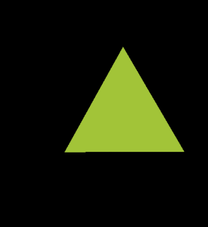
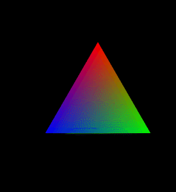

# 정사면체 그리기

[삼각형](draw-triangle.md)도 그려봤고, [사각형](draw-polygon.md)도 그려봤으니, 이제 정사면체를 그려보자.\
당연히 점의 좌표를 더 추가하면 된다.

결과부터 보자면, 각 점의 좌표와 순서는 아래와 같다.

```java
float[] coords = {
    0f/6f, 0f/6f, 3.464101f/6f,           // A(0, 0, 2*sqrt(3))
    0f/6f, 3.464101f/6f, -1.732050f/6f,   // B(0, 2*sqrt(3), -sqrt(3))
    -3f/6f, -1.732050f/6f, -1.732050f/6f, // C(-3, -sqrt(3), -sqrt(3))
    3f/6f, -1.732050f/6f, -1.732050f/6f   // D(3, -sqrt(3), -sqrt(3))
};
final short[] drawOrder = { // order to draw vertices
    0, 1, 2,  // ABC
    0, 2, 3,  // ACD
    0, 3, 1,  // ADB
    1, 3, 2   // BDC
};
```

한 변의 길이를 1로 만드는 계산식을 위해, 반지름이 15인 구를 외심으로 하는 정사면체를 구할 것이다.

정사면체의 꼭짓점 중 z축 위에 있는 점을 A, 그리고 그 아래로 삼각형을 이루는 점을 B, C, D 라고 하자. 그리고 이 정사면체의 중심 O를 (0, 0, 0)으로 정의할 것이다.

.png>)


OpenGL 에서는 화면을 xy평면으로 하기 때문에, 일반적으로 생각하는 유클리디안 공간 좌표에서 그리는 모양과 다르게 나오는 것에 주의해야 한다.

도형은 [https://www.math3d.org/uspfpBIY](https://www.math3d.org/6dmIC93E) 에서 확인할 수 있다.


정사면체의 중심은 무게 중심이므로 AO:OH = 2:1 이다. 이 점을 이용해서 각 점을 구하면 아래와 같다.

$$
\begin{cases}
~A~(0, 0, 3\sqrt{3}) \\
~B~(0, 2\sqrt{3}, -\sqrt{3}) \\
~C~(-3, -\sqrt{3}, -\sqrt{3}) \\
~D~(3, -\sqrt{3}, -\sqrt{3})
\end{cases}
$$

변CD 만 봐도 길이가 6인 것을 알 수 있다. 한 변의 길이가 1이 될 수 있도록 전부 6으로 나누면, 한 변의 길이가 1인 정사면체의 좌표가 된다.


다른 방법으로는, model matrix를 1/6 만큼 스칼라곱 스케일링(scaling)하는 방법도 있다.


`drawOrder` 는 각 면들이 바깥쪽을 앞면으로 할 수 있도록 반시계 방향으로 정의한 것이다. (이후에 Face culling 단계에서 이 부분이 적용된다)


3차원 primitive의 정점들(vertices)이 잘 정의되었고 그려지고 있는 지 확인하기 위해서,\
터치 이벤트에 원래 튜토리얼에 제공되는 "회전(rotate)" 매트릭스 연산을를 사용하였다.




정사면체의 정점들은 잘 구성되었지만, 입체감이 전혀 없어서 "추측 하기에" 정사면체이다.

이는 fragment shader에서 _**uniform**_ 변수인 `vColor` 를 통해 같은 색상을 계속 그리기 때문이다. 정점의 위치에 상관없이 화면에 보이는 (투영되는) 지점에는 항상 `vColor` 가 찍히고 있는 것이다.

각 정점들(vertices)마다 색상을 지정해서 그려지도록 바꿔보자.

## 색 입히기

```java
final int COLORS_PER_VERTEX = 4; // r, g, b, alpha 총 4개
float colors[] = {
    1f, 1f, 1f, 1f, // 점 A의 색상 rgba(1, 1, 1, 1)
    1f, 0f, 0f, 1f, // 점 B
    0f, 1f, 0f, 1f, // 점 C
    0f, 0f, 1f, 1f, // 점 D
};

public void init() {
    // vertexBuffer를 생성하던 그 부분
    // ...
    
    // 각 vectex의 color를 attribute로 넘겨주기 위해 버퍼의 형태로 만든다.
    colorBuffer = ByteBuffer.allocateDirect(colors.length * 4).order(ByteOrder.nativeOrder()).asFloatBuffer();
    colorBuffer.put(colors);
    colorBuffer.position(0);
    
    // ...
}

public void draw(float[] mvpMatrix) {
    // ...

    // vertex shader에서 aColor 라는 attribute 변수의 핸들을 가져온다.
    mColorHandle = GLES20.glGetAttribLocation(mProgram, "aColor");
    GLES20.glVertexAttribPointer(mColorHandle, COLORS_PER_VERTEX,
            GLES20.GL_FLOAT, false,
            4 * COLORS_PER_VERTEX, colorBuffer);
    
    // ...
}
```

쉐이더 코드인 GLSL은 아래와 같이 바뀐다.

```java
protected final String vertexShaderCode =
    "uniform mat4 uMVPMatrix;" +
    "attribute vec4 vPosition;" +
    "attribute vec4 aColor;" +  // 각 vertex에 있을 색상(rgba)값 버퍼
    "varying vec4 ourColor;" +  // fragement shader로 넘어갈 보간 값
    "void main() {" +
    "    gl_Position = uMVPMatrix * vPosition;" +
    "    ourColor = aColor;" +
    "}";
protected final String fragmentShaderCode =
    "precision mediump float;" +
    "varying vec4 ourColor;" +  // 넘겨받은 보간 값
    "void main() {" +
    "    gl_FragColor = ourColor;" +
    "}";
```



이것은 _**attribute**_ 타입 때문에 가능하다. vertex shader에서 정점별로 다른 값(적절히 보간(interpolation)된 값)을 가지고 있다. 값이 보간되는 방식은, 정점과 정점 사이에 (vector로 인해) 선이 그려지는 원리를 생각해보면 된다.

이것을 다시 _**varying**_ 타입의 변수를 통 fragment shader로 전달하면 그 위치에 맞는 색상이 그려질 수 있는 것이다.


vertex shader에서는 값을 읽고 쓰는 것이 모두 가능하지만,\
fragment shader에서는 값을 읽는 것만 가능하다.


그리고 주의해야 할 점으로는, 몇 가지 설정을 추가해야 "의도대로" 동작한다.

```java
// 앞면/뒷면을 구분하는 Face culling을 활성화해야 우리가 의도한대로 렌더링된다.
// 기본적으로 반시계방향(CCW; Counter-Clock-Wise)이 앞면이고, 변경 가능하다.
GLES20.glEnable(GLES20.GL_CULL_FACE);

// vectex에서 해당 핸들러를 활성화해야 색상이 그려진다.
GLES20.glEnableVertexAttribArray(mColorHandle);
```

## Code

[https://github.com/joonas-yoon/android-opengl-example/tree/ee6a4ae569bddeab6033c71115c16e18a1d983a2](https://github.com/joonas-yoon/android-opengl-example/tree/ee6a4ae569bddeab6033c71115c16e18a1d983a2)

## Refs

* [http://wanochoi.com/?p=1114](http://wanochoi.com/?p=1114)
* [https://learnopengl.com/Advanced-OpenGL/Face-culling](https://learnopengl.com/Advanced-OpenGL/Face-culling)
* [http://www.opengl-tutorial.org/kr/beginners-tutorials/tutorial-4-a-colored-cube/](http://www.opengl-tutorial.org/kr/beginners-tutorials/tutorial-4-a-colored-cube/)
