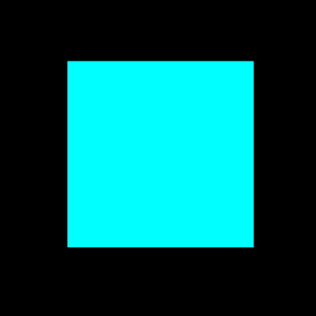
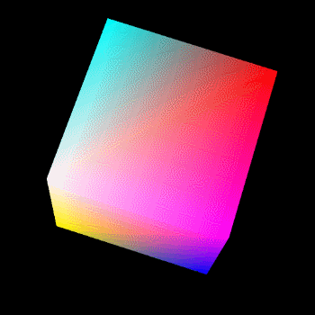

# \[WIP\] 마인크래프트 블럭 만들기






```text

float textureCoords[] = {
    // (u, v), (u, v), (u, v) for a traingle
    0.0f, 0.3f, 0.0f, 0.6f, 1.0f, 0.6f, /* front  1st triangle */
    0.0f, 0.3f, 1.0f, 0.6f, 1.0f, 0.3f, /* front  2nd triangle */
    0.0f, 0.3f, 0.0f, 0.6f, 1.0f, 0.6f, /* right  1st triangle */
    0.0f, 0.3f, 1.0f, 0.6f, 1.0f, 0.3f, /* right  2nd triangle */
    0.0f, 0.3f, 0.0f, 0.6f, 1.0f, 0.6f, /* back   1st triangle */
    0.0f, 0.3f, 1.0f, 0.6f, 1.0f, 0.3f, /* back   2nd triangle */
    0.0f, 0.3f, 0.0f, 0.6f, 1.0f, 0.6f, /* left   1st triangle */
    0.0f, 0.3f, 1.0f, 0.6f, 1.0f, 0.3f, /* left   2nd triangle */
    0.0f, 0.0f, 0.0f, 0.3f, 1.0f, 0.3f, /* top    1st triangle */
    0.0f, 0.0f, 1.0f, 0.3f, 1.0f, 0.0f, /* top    2nd triangle */
    0.0f, 0.6f, 0.0f, 1.0f, 1.0f, 1.0f, /* bottom 1st triangle */
    0.0f, 0.6f, 1.0f, 1.0f, 1.0f, 0.6f, /* bottom 2nd triangle */
};
```


## Links

* [http://www.opengl-tutorial.org/kr/beginners-tutorials/tutorial-5-a-textured-cube/](http://www.opengl-tutorial.org/kr/beginners-tutorials/tutorial-5-a-textured-cube/)
* [https://blog.daum.net/aero2k/84](https://blog.daum.net/aero2k/84)
* [https://www.learnopengles.com/android-lesson-four-introducing-basic-texturing/](https://www.learnopengles.com/android-lesson-four-introducing-basic-texturing/)

